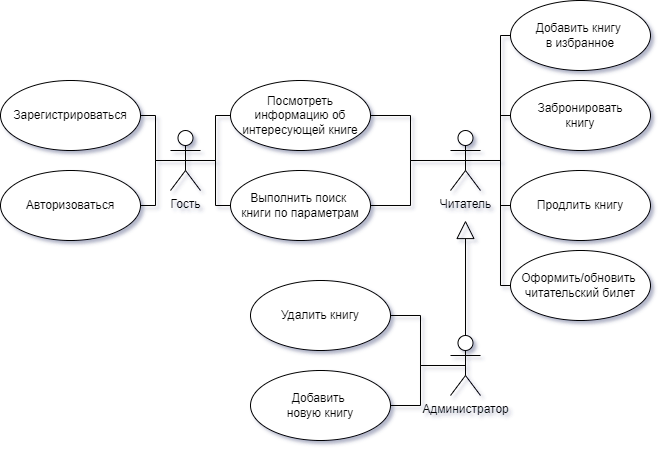
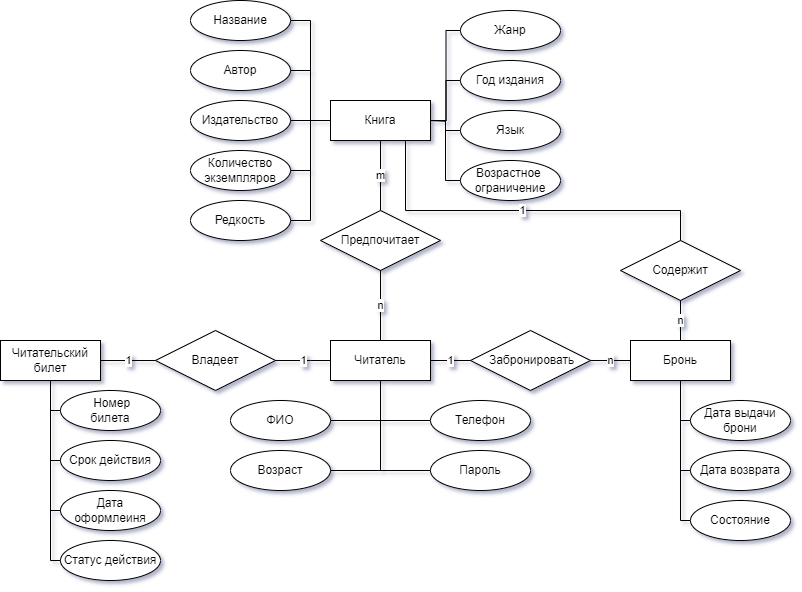
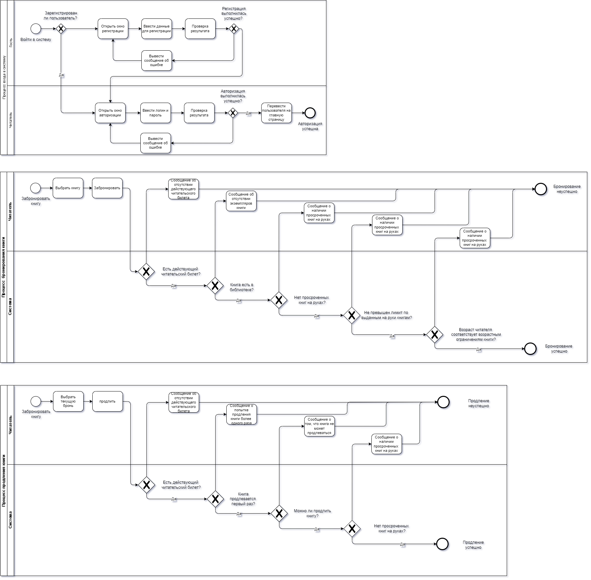
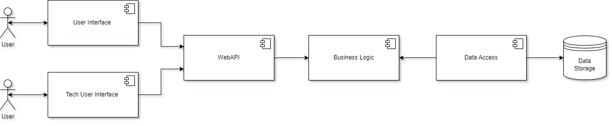
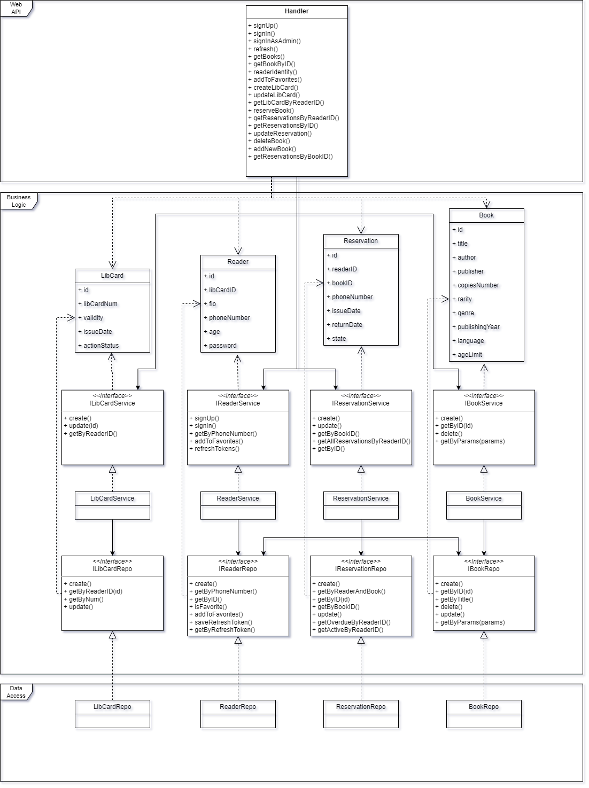
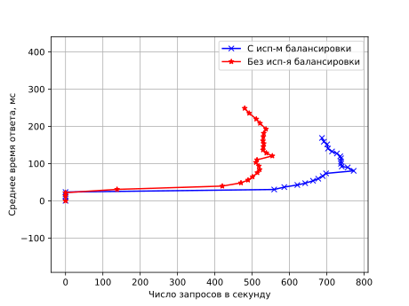

# ППО. Лабораторная №1

## 1. Название проекта

​	BookSmart -- сервис для бронирования книг в библиотеке

## 2. Краткое описание идеи проекта 
​	Данный проект представляет собой сервис для бронирования книг в библиотеке. Данное приложение позволит автоматизировать процесс бронирования книг, их продления, а также предоставлять всю необходимую информацию по книгам.

## 3. Краткое описание предметной области

​	Библиотеки играют ключевую роль в образовании и культуре, предоставляя доступ к огромному количеству знаний и информации. С развитием технологий, традиционные библиотечные процессы претерпевают значительные изменения. Одним из таких процессов является бронирование книг.

## 4. Краткий анализ аналогичных решений по минимум 3 критериям

  

    <table>
      <tr>
        <th>Аналог</th>
        <th>Поиск книг по разным параметрам</th>
        <th>Наличие личного кабинета</th>
        <th>Просмотр истории прочтения</th>
        <th>Возможность продления книги</th>
      </tr>
      <tr>
        <td>Библиотеки Москвы</td>
        <td>да</td>
        <td>да</td>
        <td>нет</td>
        <td>нет</td>
      </tr>
      <tr>
        <td>Коряжемская библиотечная система</td>
        <td>нет</td>
        <td>нет</td>
        <td>нет</td>
        <td>да</td>
      </tr>
      <tr>
        <td>Предлагаемое решение</td>
        <td>да</td>
        <td>да</td>
        <td>да</td>
        <td>да</td>
      </tr>
    </table>
  

## 5. Краткое обоснование целесообразности и актуальности проекта

​	Сервис по бронированию книг в библиотеке будет актуален всегда, пока существуют сами библиотеки. Он позволяет пользователям экономить время при поиске нужной книги, обеспечивая уверенность в её доступности к моменту визита. 

## 6. Краткое описание акторов

  

    <table>
      <tr>
        <th>Актор</th>
        <th>Описание</th>
      </tr>
      <tr>
        <td>Гость</td>
        <td>Может зарегистрироваться в системе, войти в систему. Может просмотреть каталог, информацию об интересующей книге</td>
      </tr>
      <tr>
        <td>Читатель</td>
        <td>Может делать все, что может делать гость, а также забронировать книгу, продлить ее, добавить в избранное, оформить читательский билет </td>
      </tr>
      <tr>
        <td>Администратор</td>
        <td>Может делать все, что и читатель, а также добавить новую книгу или удалить уже существующую</td>
      </tr>
    </table>
  

## 7. Use-Case - диаграмма

## 8. ER-диаграмма сущностей

## 9. Пользовательские сценарии

__Гость__:

1. Регистрация: пользователь вводит в форму ФИО, возраст, номер телефона и придуманный пароль.
2. Авторизация: пользователь вводит в форму номер телефона и пароль.

__Читатель__:
1. Поиск книги по параметрам: 
   * пользователь  вводит необходимые параметры поиска (автор, год издания, жанр, возрастное ограничение и т. д.);
   *  пользователь просматривает список выданных по результатам поиска книг.
2. Бронирование книги:

   * пользователь выбирает понравившуюся книгу;

   * пользователь бронирует ее.
3. Продление книги: 
   * пользователь выбирает забронированную им ранее книгу с приближающимся сроком возврата;
   * пользователь продлевает ее.

__Администратор__:

1. Добавление новой книги: администратор вводит в форму данные новой книги.
2. Удаление книги: администратор удаляет книгу из системы.

## Сложные кейсы

1. __Бронирование книги__ 

   Чтобы успешно забронировать книгу, пользователь должен иметь действующий читательский билет, не иметь просроченных книг на руках, число книг на руках с текущим бронированием не должно превышать установленного библиотекой лимита выданных книг, а также в библиотеке должен быть быть в наличии  экземпляр бронируемой книги и возраст, указанный в личном кабинете, должен соответствовать возрастным ограничениям книги.

2. __Продление книги__ 

   Чтобы успешно продлить книгу, пользователь должен иметь действующий читательский билет, продлевать книгу первый раз (книга продлевается 1 раз). Также сама книга должна быть продлеваемой и у пользователя не должно быть просроченных книг на руках.

3. __Авторизация__ 

## 10. Формализация ключевых бизнес-процессов

# ППО. Лабораторная №2

## 1. Описание типа приложения и выбранного технологического стека

### Тип приложения: 

​	Web-MPA

### Технологический стек: 

- Backend: Go
- Frontend: HTML + CSS + JS
- Database: PostgreSQL

## 2. Верхнеуровневое разбиение на компоненты

## 3. UML диаграммы классов для двух отдельных компонентов - компонента доступа к данным и компонента с бизнес-логикой

### UML диаграмма классов:

# WEB. Лабораторная №5

## Проведение нагрузочного тестирования

### Цель исследования

Целью исследования является проведение сравнительного анализа зависимости среднего времени ответа на запросы от числа запросов в секунду с использованием кеша и балансировки нагрузки и без.

### Наборы варьируемых и фиксируемых параметров

- максимальное число пользователей (равно 500);
- прирост пользователей в секунду (равно 10);
- длительность нагрузочного тестирования (равно 1 минуте).

Для проведения исследования были отобраны запросы на выполнение трех действий в рамках созданной системы:

- запрос на получение страницы книг;
- запрос на получение информации о книге;
- запрос на получение рейтинга книги.

В качестве кеша и балансировщика нагрузки использовался веб сервер [nginx](http://nginx.org).

### Результаты нагрузочного тестирования

  

    

      <table >
        <caption>Среднее время ответа в зависимости от числа 
         запросов в секунду без использования балансировки и кеширования</caption>
        <tr>
          <th>Число запросов в секунду</th>
          <th>Среднее время ответа, мс</th>
        </tr>
        <tr>
          <td>0</td>
          <td>0.000</td>
        </tr>
        <tr>
          <td>0</td>
          <td>38.689</td>
        </tr>
        <tr>
          <td>0</td>
          <td>54.833</td>
        </tr>
        <tr>
          <td>117</td>
          <td>61.417</td>
        </tr>
        <tr>
          <td>211</td>
          <td>71.909</td>
        </tr>
        <tr>
          <td>258</td>
          <td>81.756</td>
        </tr>
        <tr>
          <td>286</td>
          <td>94.374</td>
        </tr>
        <tr>
          <td>309</td>
          <td>103.412</td>
        </tr>
        <tr>
          <td>320</td>
          <td>120.481</td>
        </tr>
        <tr>
          <td>331</td>
          <td>138.697</td>
        </tr>
        <tr>
          <td>327</td>
          <td>147.772</td>
        </tr>
        <tr>
          <td>324</td>
          <td>164.600</td>
        </tr>
        <tr>
          <td>322</td>
          <td>180.367</td>
        </tr>
        <tr>
          <td>343</td>
          <td>199.170</td>
        </tr>
        <tr>
          <td>345</td>
          <td>218.503</td>
        </tr>
        <tr>
          <td>337</td>
          <td>240.520</td>
        </tr>
        <tr>
          <td>328</td>
          <td>253.007</td>
        </tr>
        <tr>
          <td>314</td>
          <td>265.664</td>
        </tr>
        <tr>
          <td>297</td>
          <td>276.393</td>
        </tr>
        <tr>
          <td>299</td>
          <td>286.791</td>
        </tr>
        <tr>
          <td>308</td>
          <td>297.261</td>
        </tr>
        <tr>
          <td>313</td>
          <td>313.299</td>
        </tr>
        <tr>
          <td>313</td>
          <td>321.988</td>
        </tr>
        <tr>
          <td>312</td>
          <td>333.492</td>
        </tr>
        <tr>
          <td>320</td>
          <td>347.970</td>
        </tr>
        <tr>
          <td>324</td>
          <td>362.839</td>
        </tr>
        <tr>
          <td>330</td>
          <td>380.277</td>
        </tr>
      </table>
    

  

  

    <table>
      <caption>Среднее время ответа в зависимости от числа запросов 
         в секунду с использованием балансировки и кеширования</caption>
      <tr>
        <th>Число запросов в секунду</th>
        <th>Среднее время ответа, мс</th>
      </tr>
      <tr>
        <td>0</td>
        <td>0.000</td>
      </tr>
      <tr>
        <td>0</td>
        <td>17.156</td>
      </tr>
      <tr>
        <td>0</td>
        <td>25.522</td>
      </tr>
      <tr>
        <td>271</td>
        <td>31.600</td>
      </tr>
      <tr>
        <td>427</td>
        <td>41.231</td>
      </tr>
      <tr>
        <td>478</td>
        <td>50.484</td>
      </tr>
      <tr>
        <td>492</td>
        <td>57.590</td>
      </tr>
      <tr>
        <td>486</td>
        <td>65.021</td>
      </tr>
      <tr>
        <td>500</td>
        <td>74.318</td>
      </tr>
      <tr>
        <td>511</td>
        <td>81.226</td>
      </tr>
      <tr>
        <td>510</td>
        <td>89.026</td>
      </tr>
      <tr>
        <td>513</td>
        <td>99.886</td>
      </tr>
      <tr>
        <td>511</td>
        <td>105.632</td>
      </tr>
      <tr>
        <td>540</td>
        <td>119.611</td>
      </tr>
      <tr>
        <td>535</td>
        <td>129.862</td>
      </tr>
      <tr>
        <td>515</td>
        <td>136.507</td>
      </tr>
      <tr>
        <td>513</td>
        <td>147.046</td>
      </tr>
      <tr>
        <td>517</td>
        <td>154.399</td>
      </tr>
      <tr>
        <td>506</td>
        <td>163.455</td>
      </tr>
      <tr>
        <td>499</td>
        <td>174.369</td>
      </tr>
      <tr>
        <td>490</td>
        <td>180.764</td>
      </tr>
      <tr>
        <td>486</td>
        <td>191.111</td>
      </tr>
      <tr>
        <td>488</td>
        <td>197.670</td>
      </tr>
      <tr>
        <td>485</td>
        <td>207.910</td>
      </tr>
      <tr>
        <td>485</td>
        <td>216.770</td>
      </tr>
      <tr>
        <td>500</td>
        <td>230.313</td>
      </tr>
    </table>
  

Анализируя выборки, представленные в таблицах выше, можно увидеть, что при числе запросов в секунду, меньших 271, среднее время ответа на запрос без использования балансировки и кеширования примерно в 2.58 больше, чем с использованием балансировки и кеширования.

При числе запросов большем, чем 271, наблюдается резкое увеличение среднего времени ответа на запрос в ситуации без использования балансировки и кеширования.

Использование кеширования и балансировки позволило увеличить максимальное число обрабатываемых запросов в секунду в 1.6 раза и уменьшить среднее время ответа в 1.7 раза.

# WEB. Лабораторная №6

[Макеты интерфейсов в Figma](https://www.figma.com/design/E5qk9wR4yClYZI6Wmai1bm/BookSmart?node-id=18-14&t=Uw92z32iasdwAiRR-1)

## Портреты пользователей

См. ППО

## PS 

Тут и сделаны абсолютно все лабы по ППО, включая даже 7-ю, 8-ю и 9-ю. Схемы в связи с 8-й лабой не обновлял -- лень)