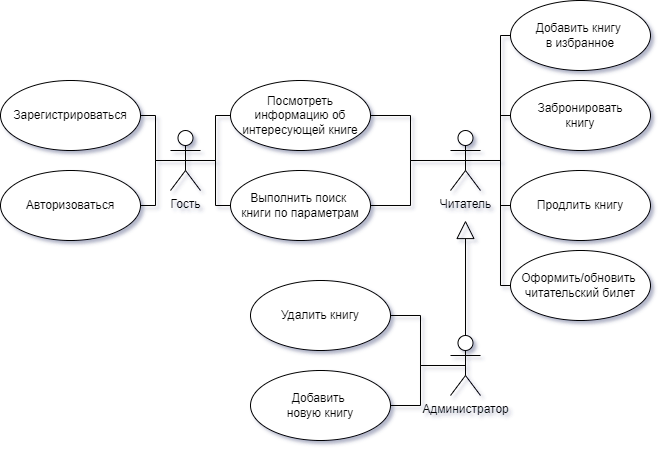
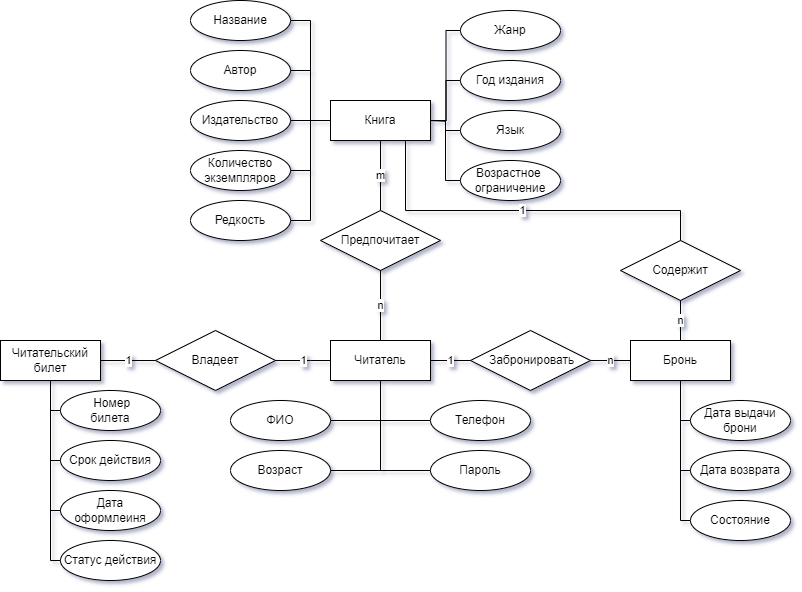
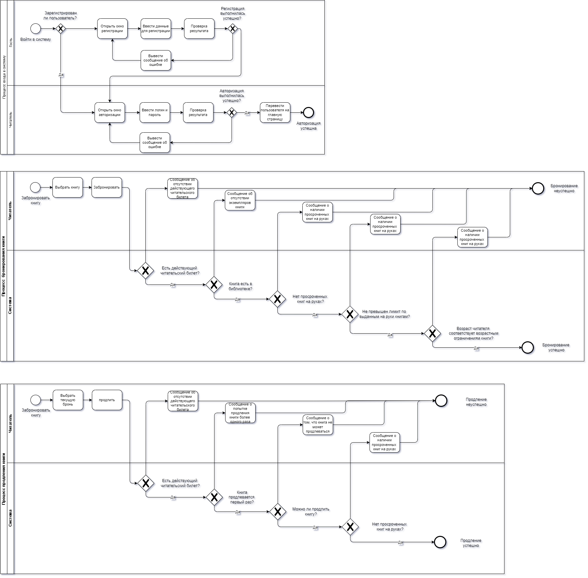
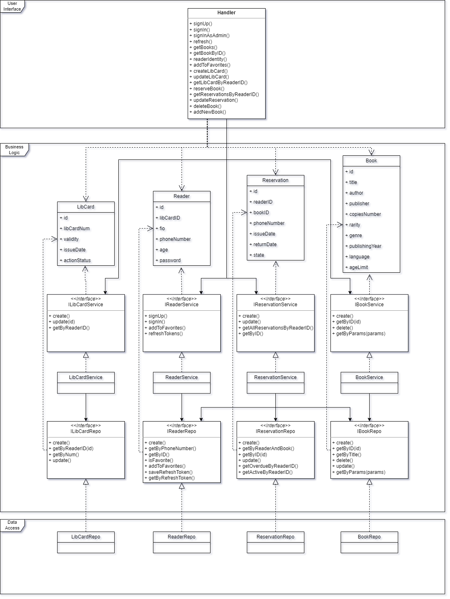

# ППО. Лабораторная №1

## 1. Название проекта

​	BookSmart -- сервис для бронирования книг в библиотеке

## 2. Краткое описание идеи проекта 
​	Данный проект представляет собой сервис для бронирования книг в библиотеке. Данное приложение позволит автоматизировать процесс бронирования книг, их продления, а также предоставлять всю необходимую информацию по книгам.

## 3. Краткое описание предметной области

​	Библиотеки играют ключевую роль в образовании и культуре, предоставляя доступ к огромному количеству знаний и информации. С развитием технологий, традиционные библиотечные процессы претерпевают значительные изменения. Одним из таких процессов является бронирование книг.

## 4. Краткий анализ аналогичных решений по минимум 3 критериям

  

    <table>
      <tr>
        <th>Аналог</th>
        <th>Поиск книг по разным параметрам</th>
        <th>Наличие личного кабинета</th>
        <th>Просмотр истории прочтения</th>
        <th>Возможность продления книги</th>
      </tr>
      <tr>
        <td>Библиотеки Москвы</td>
        <td>да</td>
        <td>да</td>
        <td>нет</td>
        <td>нет</td>
      </tr>
      <tr>
        <td>Коряжемская библиотечная система</td>
        <td>нет</td>
        <td>нет</td>
        <td>нет</td>
        <td>да</td>
      </tr>
      <tr>
        <td>Предлагаемое решение</td>
        <td>да</td>
        <td>да</td>
        <td>да</td>
        <td>да</td>
      </tr>
    </table>
  

## 5. Краткое обоснование целесообразности и актуальности проекта

​	Сервис по бронированию книг в библиотеке будет актуален всегда, пока существуют сами библиотеки. Он позволяет пользователям экономить время при поиске нужной книги, обеспечивая уверенность в её доступности к моменту визита. 

## 6. Краткое описание акторов

  

    <table>
      <tr>
        <th>Актор</th>
        <th>Описание</th>
      </tr>
      <tr>
        <td>Гость</td>
        <td>Может зарегистрироваться в системе, войти в систему. Может просмотреть каталог, информацию об интересующей книге</td>
      </tr>
      <tr>
        <td>Читатель</td>
        <td>Может делать все, что может делать гость, а также забронировать книгу, продлить ее, добавить в избранное, оформить читательский билет </td>
      </tr>
      <tr>
        <td>Администратор</td>
        <td>Может делать все, что и читатель, а также добавить новую книгу или удалить уже существующую</td>
      </tr>
    </table>
  

## 7. Use-Case - диаграмма

## 8. ER-диаграмма сущностей

## 9. Пользовательские сценарии

__Гость__:

1. Регистрация: пользователь вводит в форму ФИО, возраст, номер телефона и придуманный пароль.
2. Авторизация: пользователь вводит в форму номер телефона и пароль.

__Читатель__:
1. Поиск книги по параметрам: 
   * пользователь  вводит необходимые параметры поиска (автор, год издания, жанр, возрастное ограничение и т. д.);
   *  пользователь просматривает список выданных по результатам поиска книг.
2. Бронирование книги:

   * пользователь выбирает понравившуюся книгу;

   * пользователь бронирует ее.
3. Продление книги: 
   * пользователь выбирает забронированную им ранее книгу с приближающимся сроком возврата;
   * пользователь продлевает ее.

__Администратор__:

1. Добавление новой книги: администратор вводит в форму данные новой книги.
2. Удаление книги: администратор удаляет книгу из системы.

## Сложные кейсы

1. __Бронирование книги__ 

   Чтобы успешно забронировать книгу, пользователь должен иметь действующий читательский билет, не иметь просроченных книг на руках, число книг на руках с текущим бронированием не должно превышать установленного библиотекой лимита выданных книг, а также в библиотеке должен быть быть в наличии  экземпляр бронируемой книги и возраст, указанный в личном кабинете, должен соответствовать возрастным ограничениям книги.

2. __Продление книги__ 

   Чтобы успешно продлить книгу, пользователь должен иметь действующий читательский билет, продлевать книгу первый раз (книга продлевается 1 раз). Также сама книга должна быть продлеваемой и у пользователя не должно быть просроченных книг на руках.

3. __Авторизация__ 

## 10. Формализация ключевых бизнес-процессов

# ППО. Лабораторная №2

## 1. Описание типа приложения и выбранного технологического стека

### Тип приложения: 

​	Web-MPA

### Технологический стек: 

- Backend: Go
- Frontend: HTML + CSS + JS
- Database: PostgreSQL

## 2. Верхнеуровневое разбиение на компоненты

## 3. UML диаграммы классов для двух отдельных компонентов - компонента доступа к данным и компонента с бизнес-логикой

### UML диаграмма классов:

